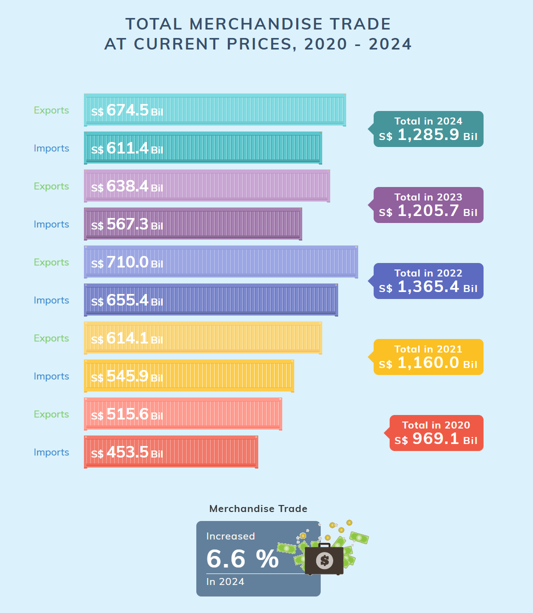
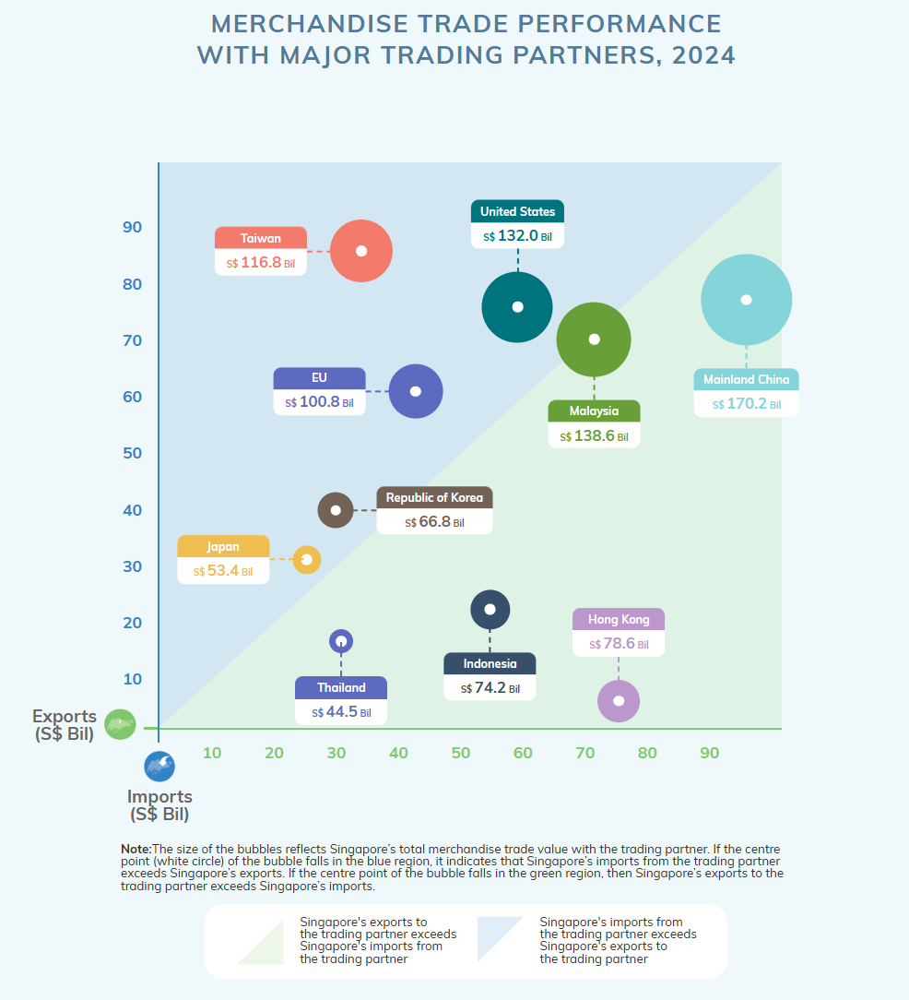
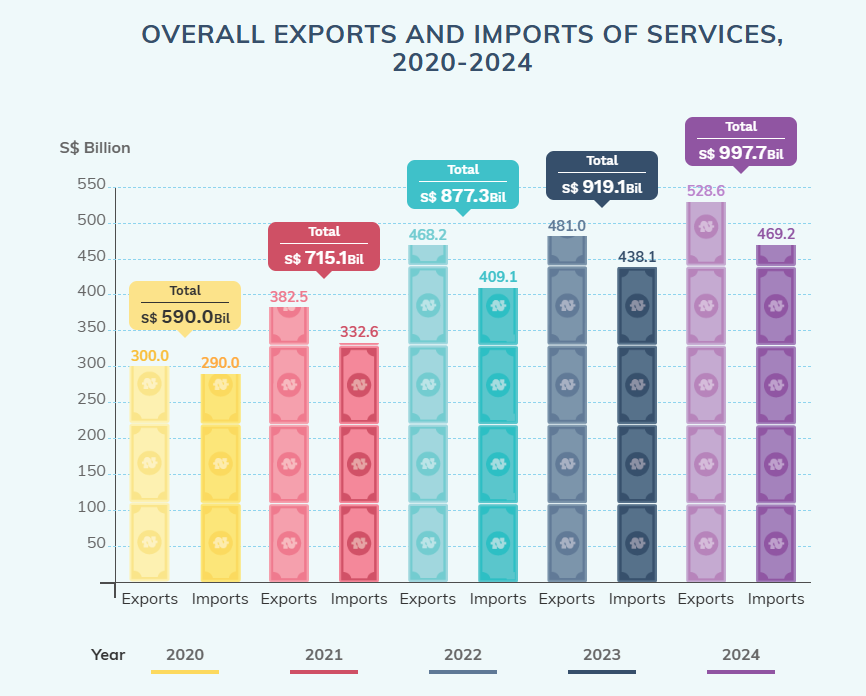

# Take Home Exercise 02 - Be Trade wise or Otherwise

## Data Preparation

::: panel-tabset
## Importing Library

```{r}
pacman::p_load(corrplot, readxl, ggiraph, ggplot2, tidyverse, ggthemes, tidyr,patchwork, ggstatsplot, plotly, dplyr)
```

## Importing Dataset

```{r}
Import <- read_excel("data/Trade.xlsx",sheet = "T1", skip = 10)
Domestic_Export <- read_excel("data/Trade.xlsx",sheet = "T2", skip = 10)
Re_Export <- read_excel("data/Trade.xlsx",sheet = "T3", skip = 10)
```

Using 'read_excel' from 'readxl' package can allow us to split the excel sheets. Also, since the 'Trade.xlsx' file contains 4 sheets as well as the first 10 row is description therefore, I skip the first 10 rows\

## Understanding the table

```{r}
#| warning: false
colnames(Import)
colnames(Domestic_Export)
colnames(Re_Export)

```

From the table structure, the column names are organized by year and month, such as "2024 Jan", "2024 Dec", "2023 Nov", indicating that the data is recorded in a time-series format, with each column representing the export data for a specific month. To conduct an annual summary analysis, all monthly data needs to be converted to a long format, where Year becomes a separate column, and the month information is removed, keeping only the year. This transformation allows for the aggregation of data from the same year, enabling the calculation of total annual exports and providing a clearer view of trade trends over time.
:::

## Data visualization 1



This is the first data visualisation posted on the page on statistic Singapore. It is the total merchandise trade for Singapore between the year 2020 and 2024. There are both pros and cons on this visualisation:

::: panel-tabset
### Pros

The biggest advantage of this visualization is its distinct color differentiation, with each year represented by a different color, allowing readers to quickly identify and compare yearly trends. This color scheme effectively highlights annual variations, making the overall trade trends clear at a glance. Additionally, the use of horizontal bar charts aligns with the natural left-to-right reading habit, making it easier to visually compare total trade values across different years for better analysis.

### Cons

Despite its readability in terms of color and layout, this chart has some limitations. First, it lacks clear labels, making some information less intuitive and harder for readers to quickly locate specific data or gain deeper insights into the trade structure. Second, this visualization is not interactive, preventing users from freely filtering or exploring the data in greater detail, such as breaking it down by industry category or examining specific changes. This static presentation limits the depth of information and reduces the flexibility of data analysis.
:::

### Re-sketches and make-over

First we need to combine the sheets together to get the total export in each year.

```{r}
colnames(Domestic_Export)[1] <- "Region"
colnames(Re_Export)[1] <- "Region"

Domestic_Total <- Domestic_Export %>%
  filter(Region == "Total All Markets")

Re_Export_Total <- Re_Export %>%
  filter(Region == "Total All Markets")

Domestic_long <- Domestic_Total %>%
  pivot_longer(cols = -Region, names_to = "Year", values_to = "Domestic_Export_Value")

Re_Export_long <- Re_Export_Total %>%
  pivot_longer(cols = -Region, names_to = "Year", values_to = "Re_Export_Value")

Export_Total <- full_join(Domestic_long, Re_Export_long, by = "Year")

Export_Total <- Export_Total %>%
  mutate(Year = as.numeric(substr(Year, 1, 4)))

Export_Total <- Export_Total %>%
  mutate(across(c(Domestic_Export_Value, Re_Export_Value), ~ as.numeric(gsub(",", "", .))))

Total_Exports <- Export_Total %>%
  group_by(Year) %>%
  summarise(Total_Export = sum(Domestic_Export_Value, na.rm = TRUE) + sum(Re_Export_Value, na.rm = TRUE))

print(Total_Exports)


Import_Total <- Import %>%
  filter(`Data Series` == "Total All Markets") %>%
  pivot_longer(cols = -`Data Series`, names_to = "Year", values_to = "Import_Value") %>%
  mutate(Year = as.numeric(substr(Year, 1, 4))) %>%
  group_by(Year) %>%
  summarise(Total_Import = sum(Import_Value, na.rm = TRUE))

print(Import_Total)

```

First, we read the T2 (Domestic Export) and T3 (Re-Export) sheets from the `Trade.xlsx` file, skipping the first 10 rows of description. Then, we filtered the data to keep only the "Total All Markets" row, as it represents Singapore's overall export figures.

Next, we transformed the data into long format, converting monthly values into a single column so that `Year` becomes a separate variable, making it easier to analyze. Since the original data contains months like "Jan" and "Feb," we extracted only the first four characters to keep only the year (e.g., 2024, 2023, 2022).

To ensure accurate calculations, we converted the export values from character format to numeric, removing any commas to prevent errors. After data cleaning, we aggregated the exports by year, calculating Total Export = Domestic Export + Re-Export to obtain the annual total export values.

Finally, we generated a `Total_Exports` table containing `Year` and `Total_Export` columns. This dataset can now be used to visualize the annual export trends, providing insights into Singapore's trade performance over the years.

```{r}
Total_Exports <- Total_Exports %>%
  mutate(Year = as.integer(Year))
Filtered_Total_Exports <- Total_Exports %>%
  filter(Year >= 2020 & Year <= 2024)

Filtered_Total_Imports <- Import_Total %>%
  filter(Year >= 2020 & Year <= 2024)


format_km <- function(x) {
  ifelse(x >= 1e6, paste0(round(x / 1e6, 0), "M"),
         paste0(round(x / 1e3, 0), "K"))
}
```

```{r}
Export_BarChart <- ggplot(Filtered_Total_Exports, aes(x = as.factor(Year), y = Total_Export, fill = as.factor(Year))) +
  geom_col(color = "black", width = 0.6) +  
  geom_text(aes(label = format_km(Total_Export)), vjust = -1.5, size = 5, fontface = "bold") +  
  scale_y_continuous(labels = format_km) +  
  scale_fill_manual(values = c("2020" = "#FF9999", "2021" = "#69b3a2", "2022" = "#FFCC00", "2023" = "#3399FF", "2024" = "#9933FF")) +  
  labs(title = "Singapore Export (2020-2024)",
       x = "Year",
       y = "Total Export (S$ Billion)",
       fill = "Year") +
  theme_minimal(base_size = 14) +
  theme(
    plot.title = element_text(size = 16, face = "bold"),
    axis.text.x = element_text(face = "bold", family = "Comic Sans MS")
  )

Import_BarChart <- ggplot(Filtered_Total_Imports, aes(x = as.factor(Year), y = Total_Import, fill = as.factor(Year))) +
  geom_col(color = "black", width = 0.6) +  
  geom_text(aes(label = format_km(Total_Import)), vjust = -1.5, size = 5, fontface = "bold") +  
  scale_y_continuous(labels = format_km) +  
  scale_fill_manual(values = c("2020" = "#FF9999", "2021" = "#69b3a2", "2022" = "#FFCC00", "2023" = "#3399FF", "2024" = "#9933FF")) +  
  labs(title = "Singapore Import (2020-2024)",
       x = "Year",
       y = "Total Import (S$ Billion)",
       fill = "Year") +
  theme_minimal(base_size = 14) +
  theme(
    plot.title = element_text(size = 16, face = "bold"),
    axis.text.x = element_text(face = "bold", family = "Comic Sans MS")
  )

Export_Interactive <- ggplotly(Export_BarChart)
Import_Interactive <- ggplotly(Import_BarChart)

Export_Interactive
Import_Interactive
```

I optimized the original statistical chart to make Singapore's import and export data from 2020 to 2024 clearer and more intuitive. First, total exports and total imports were extracted from the dataset and aggregated by year to ensure data consistency. Then, two separate bar charts were created, with different colors used to distinguish each year, making trends more apparent. The numerical format was optimized using K (thousands) notation to avoid visual clutter, and ggplotly was applied to enhance interactivity, allowing users to hover over the chart for precise values. The optimized visualization improves readability, highlights trends more effectively, and enhances interactivity, making the analysis of Singapore's trade data more efficient.

## Data visualization 2



::: panel-tabset
### Pros

This chart effectively highlights the average levels of imports and exports using a white center point, allowing users to quickly assess trade balance. Additionally, different colors are used to distinguish countries, with country names directly labeled on the chart. This makes key trading partners easily identifiable, reducing reliance on additional legends and improving readability.

### Cons

The chart is overly complex, requiring users to take time analyzing bubble sizes and positions to understand the data, which reduces intuitiveness. Specific import and export values are not directly displayed, forcing users to hover for details instead of seeing trade figures at a glance. The legend colors for imports and exports are quite similar, which, especially on a light background, may make it harder for users to quickly differentiate between import and export areas, reducing the efficiency of information delivery.
:::

### Re-sketches and make-over

```{r}
Import$`Data Series` <- trimws(Import$`Data Series`)
Import_2024 <- Import %>% select(`Data Series`, starts_with("2024")) %>%
  group_by(`Data Series`) %>%
  summarise(Total_Imports_2024 = sum(across(starts_with("2024")), na.rm = TRUE)) %>%
  distinct()

Domestic_Export$Region <- trimws(Domestic_Export$Region)
Domestic_Export_2024 <- Domestic_Export %>% select(Region, starts_with("2024")) %>%
  group_by(Region) %>%
  summarise(Total_Domestic_Exports_2024 = sum(across(starts_with("2024")), na.rm = TRUE)) %>%
  distinct()

Re_Export$Region <- trimws(Re_Export$Region)
Re_Export_2024 <- Re_Export %>% select(Region, starts_with("2024")) %>%
  group_by(Region) %>%
  summarise(Total_Re_Exports_2024 = sum(across(starts_with("2024")), na.rm = TRUE)) %>%
  distinct()

Trade_2024 <- Import_2024 %>%
  rename(Region = `Data Series`) %>%  
  left_join(Domestic_Export_2024, by = "Region") %>%
  left_join(Re_Export_2024, by = "Region")


Trade_2024[ , 2:ncol(Trade_2024)] <- lapply(Trade_2024[ , 2:ncol(Trade_2024)], function(x) ifelse(is.na(x), 0, x))


Trade_2024 <- Trade_2024 %>%
  mutate(
    Total_Exports_2024 = Total_Domestic_Exports_2024 + Total_Re_Exports_2024,
    Trade_Volume_2024 = Total_Imports_2024 + Total_Exports_2024
  )


major_partners <- c("United States", "China", "European Union", "Malaysia", "Taiwan",
                    "Hong Kong", "Japan", "Korea, Rep Of", "Indonesia", "Thailand")

Trade_2024 <- Trade_2024 %>% filter(Region %in% major_partners)

EDA2 <- ggplot(Trade_2024, aes(x = Total_Imports_2024, y = Total_Exports_2024, 
                            size = Trade_Volume_2024, color = Trade_Volume_2024)) + 
  geom_point(alpha = 0.7) + 
  geom_text(aes(label = Region), 
            vjust = 1.5, size = 5, color = "black", fontface = "bold") +  
  scale_size(range = c(5, 20)) +  
  scale_color_gradient(low = "#add8e6", high = "#00008b") +  
  theme_minimal() +
  labs(title = "Merchandise Trade Performance with Major Trading Partners (2024)",
       x = "Imports (S$ Bil)", y = "Exports (S$ Bil)", 
       size = "Trade Volume", color = "Trade Volume") +
  theme(legend.position = "bottom")

ggplotly(EDA2)

```

The new version of the visualization is more intuitive and efficient, enhancing both readability and user interaction. First, the color scheme was optimized by using a gradient from light blue to dark blue, allowing bubble colors to directly reflect trade volume—the larger the trade amount, the darker the color—enhancing the visual hierarchy of the data. Additionally, country names were standardized in black to ensure clarity against different backgrounds without interference from bubble colors. Unnecessary text labels were removed to make the chart cleaner and reduce information overload, while interactive features remain, allowing users to hover for detailed data. Overall, this version aligns better with best practices in data visualization, enabling users to quickly grasp the import and export performance of major trade partners without needing to interpret complex legends or labels.

## Data visualization 3



::: panel-tabset
### Pros

This chart has a creative design, using different colors for each year, making it more visually engaging and allowing viewers to quickly distinguish between years. Additionally, the export and import values are clearly labeled on the bars, eliminating the need for estimation and improving data clarity and readability.

### Cons

The color contrast between exports and imports is not strong enough, making it difficult to differentiate them quickly in some cases. Using higher-contrast colors could enhance readability. Furthermore, while the chart currently highlights total values, net export (Net Export = Exports - Imports) might be a more valuable metric, as it directly reflects a country’s trade surplus or deficit rather than just the total import and export amounts.
:::

### Re-sketches and make-over

```{r}
Net_Export_df <- left_join(Filtered_Total_Exports, Filtered_Total_Imports, by = "Year") %>%
  mutate(Net_Export = Total_Export - Total_Import) %>%
  pivot_longer(cols = c(Total_Export, Total_Import), names_to = "Type", values_to = "Value")

Net_Export_df


format_k <- function(x) {
  paste0(round(x / 1e3, 0), "K")
}


y_max <- max(Net_Export_df$Value) * 1.2  # **增加 20% 作为上限**

export_import_colors <- c(
  "2020_Export" = "#1B4F72", "2020_Import" = "#85C1E9",  
  "2021_Export" = "#922B21", "2021_Import" = "#F1948A",  
  "2022_Export" = "#117A65", "2022_Import" = "#76D7C4",  
  "2023_Export" = "#283747", "2023_Import" = "#AAB7B8",  
  "2024_Export" = "#6C3483", "2024_Import" = "#D2B4DE"   
)

Net_Export_df <- Net_Export_df %>%
  mutate(Year_Type = paste0(Year, "_", ifelse(Type == "Total_Export", "Export", "Import")))

p <- ggplot(Net_Export_df, aes(x = as.factor(Year), y = Value, fill = Year_Type)) +
  geom_col(position = "dodge", width = 0.6, color = "black") +  

  geom_text(aes(label = format_k(Value)), 
            vjust = -0.5, size = 3, color = "black", position = position_dodge(0.7)) +

  geom_text(data = Net_Export_df %>% filter(Type == "Total_Export"), 
            aes(x = as.factor(Year), y = Value + 50,  
                label = paste0("Net Export = ", format_k(Net_Export))),
            vjust = -3, size = 3.5, fontface = "bold", color = "black") +

  scale_fill_manual(values = export_import_colors) +
  scale_y_continuous(limits = c(0, y_max)) +  
  labs(title = "Overall Exports and Imports of Services (2020-2024)",
       x = "Year", y = "S$ Billion", fill = "Year & Type") +

  theme_minimal(base_size = 10) +  
  theme(
    plot.title = element_text(size = 12, face = "bold"),
    axis.text.x = element_text(face = "bold"),
    plot.margin = margin(5, 5, 5, 5)  
  )

print(p)
```

This chart is an improved version that enhances the contrast between exports (Export) and imports (Import), making the data more intuitive and easier to read. Additionally, the total (Total) value at the top has been replaced with net export (Net Export), providing a clearer view of the trade surplus during the 2020-2024 period. This adjustment helps in better understanding the economic situation of that time. The chart shows that exports consistently exceeded imports each year, indicating a trade surplus, which reflects strong economic performance over these years.

## Time-series analysis

```{r}
pacman::p_load(tidyverse, tsibble, feasts, fable, seasonal,dplyr,lubridate,readxl)
```

### Importing data

```{r}
ts_data <- read_excel("data/Trade.xlsx", sheet = "Time_Series")

colnames(ts_data)[1] <- "Month-Year"

ts_data$`Month-Year` <- trimws(as.character(ts_data$`Month-Year`))

ts_data <- ts_data %>%
  mutate(Year = substr(`Month-Year`, 1, 4),
         Month = substr(`Month-Year`, 6, 8))

ts_data$`Month-Year` <- paste0("01-", ts_data$Month, "-", ts_data$Year)

ts_data$`Month-Year` <- dmy(ts_data$`Month-Year`)

ts_data <- ts_data %>% select(-Month, -Year)

head(ts_data)
```

### Visualizing Time-series Data

```{r}
ts_longer <- ts_data %>%
  pivot_longer(cols = -`Month-Year`, names_to = "Country", values_to = "Value")

ts_longer %>%
  filter(Country == "Total All Markets") %>%
  ggplot(aes(x = `Month-Year`, y = Value)) +
  geom_line(size = 0.5)

```

### Plotting multiple time-series data with ggplot2 methods

```{r}
ts_longer %>%
  filter(Country %in% c("China", "United States", "Germany","Japan","Canada")) %>%
  ggplot(aes(x = `Month-Year`, y = Value, color = Country)) +
  geom_line(size = 0.5) +
  theme(legend.position = "bottom")


```

I have selected five countries (China, United States, Germany, Japan, Canada) to visualize their time-series data, showing trends over time using a multi-line plot.

In order to provide effective comparison, [`facet_wrap()`](https://ggplot2.tidyverse.org/reference/facet_wrap.html) of ggplot2 package is used to create small multiple line graph also known as trellis plot.

```{r}
selected_countries <- c("China", "United States", "Germany", "Japan", "Canada")

ggplot(data = ts_longer %>% filter(Country %in% selected_countries), 
       aes(x = `Month-Year`, y = Value)) +
  geom_line(size = 0.5) +
  facet_wrap(~ Country, ncol = 3, scales = "free_y") +
  theme_bw()


```

## Visual Analysis of Time-series Data

```{r}
tsibble_longer <- ts_longer %>%
  mutate(`Month-Year` = yearmonth(`Month-Year`)) %>%
  as_tsibble(index = `Month-Year`, key = Country)


```

The original `Month-Year` was in `Date` format with a default day of "01". This caused `tsibble` to misinterpret the data as daily instead of monthly. Converting it to `yearmonth(Month-Year)` ensured proper recognition of monthly data. This prevents duplicate values and allows `gg_subseries()` to function correctly.

```{r}
tsibble_longer %>%
  filter(Country %in% c("China", "United States", "Germany", "Japan","Canada")) %>%
  gg_subseries(Value)
```

### Single time series decomposition

```{r}
tsibble_longer %>%
  filter(Country %in% c("China", "United States", "Germany", "Japan","Canada")) %>%
  ACF(Value) %>% 
  autoplot()
```

This plot represents the Autocorrelation Function (ACF) for each selected country (China, United States, Germany, Japan).

-   The x-axis (lag \[1M\]) shows the lag in months, indicating how past values influence future values.

-   The y-axis (acf) represents the correlation between the time series and its lagged values.

-   The black bars show the strength of correlation at different lags, while the blue dashed lines indicate significance thresholds.

High correlations at specific lags suggest seasonal patterns or trends in the data.

## Visual Forecasting

```{r}
china_ts <- tsibble_longer %>%
  filter(Country == "China") %>%
  mutate(Type = if_else(`Month-Year` >= yearmonth("2024-01"), "Hold-out", "Training"))

china_train <- china_ts %>%
  filter(Type == "Training")

```

```{r}
china_train %>%
  model(stl = STL(Value)) %>%
  components() %>%
  autoplot()
```

The dataset was first filtered to select only China's data. A new variable, Type, was created to classify data as "Training" if it was before January 2024 and "Hold-out" otherwise. The training dataset was then extracted by keeping only the "Training" entries. Finally, an STL decomposition (Seasonal-Trend-Loess) was applied to break the time series into three components: trend, seasonal variation, and remainder (residual noise). The plot visualizes how these components evolve over time.

## Conclusion

The analysis explored time-series data through visualization, decomposition, and initial forecasting. Multiple time series were plotted to observe trends, and single series decomposition helped identify patterns. While forecasting was introduced, a detailed seasonality analysis was not conducted. Further steps could include deeper seasonal pattern exploration for better insights.
